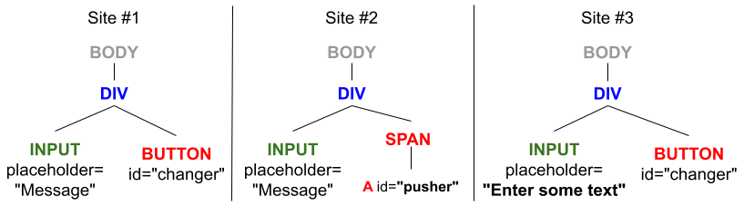
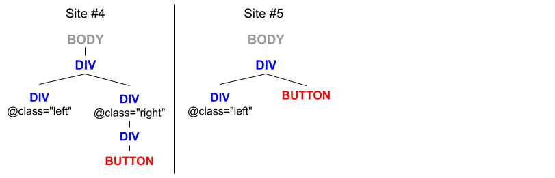

# Self-healing locators

[](https://github.com/juanfonsecaGL/SelfHealingLocatorsDemo/actions/workflows/maven.yml)

Juan M. Fonseca Solís

Gorilla Logic, Sabana Business Center 10th Floor, Bv. Ernesto Rohrmoser, San José.


## Abstract

**Problem.** Evaluate some popular self-healing driver options.

**Importance.** Self-healing drivers can reduce automation maintenance costs by automatically detecting changes in the web page layout and updating locators to ensure the test cases are functional [1].

**Theory.** Selenium.WebDriver.SelfHealing is the only available library for DotNet in the NuGet repository, and Healenium and TestRigor are only Java libraries. Selenium.WebDriver.SelfHealing offers a free monthly quota, Healenium is free without limit, and TestRigor is private with a fifteen-day trial [2, 3]. 

Only Healenium and TestRigor mention to be using of Artificial Intelligence. Healenium, in particular, uses an algorithm called "Longest Common Subsequence" (LCS). The algorithm works as follows. The webpage layout is represented in a tree data structure, where each node of the tree contains a list of numerical weights assigned to the node's atributes (for instance, tag, Id, class, and value). For each node in the tree, the LCS calculates the sequence or "path" of previous nodes needed to arrive to that node (presumably from the html's root) and stores it in a database. Then, when a layout change invalidates a path, the algorithm searches a replacement using the closest subsequence [5]:

> "solves the problem of finding the longest subsequence common to all sequences in a set of sequences with extra weight for tag, Id, class, value, other attributes. So if an element changes its place in DOM or has a new id, Healenium will find it and generate new locator." - Chernyshova, A.

**Method.** We evaluated all libraries using the following test procedure: user opens a web form, enters a value in an input field, presses a button to submit the form, and confirms that the value is displayed in a label. The test procedure was executed against the combination of locators specified in Table 1 (test cases) using the website implementation listed in Table 2 (Figure 1). 

The test procedure was implemented for DotNet using Selenium/nUnit combo and for Java using Maven/TestNg/Selenium. The test cases were executed in Healenium's docker hub container to avoid conflicts with the Driver version [2, 3].

Table 1. Test cases.

| TC | Proposed by | Site | Input box | Button | Locator Configuration |
| --- | --- | --- | --- | --- | --- |
| TC1 | TestRigor | Site #1 | `//input[@id='messageNew']` | `//button[@id='changer']` | valid |
| TC2 | TestRigor | Site #2 | `//input[@id='messageNew']` | `//a[@id='pusher']` | valid |
| TC3 | TestRigor | Site #1 | `//input[@id='messageNew']` | `//a[@id='pusher']` | broken |
| TC4 | TestRigor | Site #2 | `//input[@id='messageNew']` | `//button[@id='changer']` | broken |
| TC5 | Chernyshova, A. (Healenium) | Site #1 | `//input[@placeholder='Message']` | `//button[@id='changer']` | valid |
| TC6 | Chernyshova, A. (Healenium) | Site #3 | `//input[@placeholder='Enter some text']` | `//button[@id='changer']` | valid |
| TC7 | Chernyshova, A. (Healenium) | Site #1 | `//input[@placeholder='Enter some text']` | `//button[@id='changer']` | broken | 
| TC8 | Chernyshova, A. (Healenium) | Site #3 | `//input[@placeholder='Message']` | `//button[@id='changer']` | broken |
| TC9 | Chernyshova, A. (Healenium) | Site #4 | - | `//div[@class='container']/div/div/button` | valid |
| TC10 | Chernyshova, A. (Healenium) | Site #4 | - | `//div[@class='container']/div/div/button` | broken |
| TC11 | Chernyshova, A. (Healenium) | Site #5 | - | `//div[@class='container']/button` | valid |
| TC12 | Chernyshova, A. (Healenium) | Site #5 | - | `//div[@class='container']/div/div/button` | broken |

Table 2. Site configuration.

| Page | Input box | Button |
| --- | --- | --- |
| [Site #1](demo-site/demo-site1/form-button-label.html)  | `//input[@placeholder="Message"]`           | `//button[@id='changer']` |
| [Site #2](demo-site/demo-site1/form-button-label2.html) | `//input[@placeholder="Message"]`           | `//a[@id='pusher']` |
| [Site #3](demo-site/demo-site1/form-button-label3.html) | `//input[@placeholder="Enter some text"]`   | `//button[@id='changer']` | 
| [Site #4](demo-site/demo-site1/form-button-label2.html) | -   | `//div[@class='container']/div/div/button` |
| [Site #5](demo-site/demo-site1/form-button-label3.html) | -   | `//div[@class='container']/button` | 

Figure 1. Sites configuration.




**Results.** As shown by Table 3, Healenium is the solution with the highest pass-rate and the only one that passed its own proposed scenario. 

Table 3. Results. 

| TC | NoSelfHealing | TestRigor<sup>1</sup> | Healenium | DotNet SelfHealing | 
| --- | --- | --- | --- | --- |
| TC1 | ✓ | x | ✓ | ✓ |
| TC2 | ✓ | x | ✓ | ✓ |
| TC3 | x | x | x | x |
| TC4 | x | x | x | x |
| TC5 | ✓ | x | ✓ | ✓ |
| TC6 | ✓ | x | ✓ | ✓ |
| TC7 | x | x | ✓ | x |
| TC8 | x | x | ✓ | x |
| Pass rate | .5 | .0 | .75 | .5 |

<sup>1</sup> For TestRigor we got a "Java.lang.NoClassDefFoundError: com/testrigor/selfhealingselenium/infrastructure/adapters/TestrigorAdapter" error.

**Future work.** 
1. Find more scenarios of broken locators to evaluate the implemented libraries.
2. Incorporate more libraries.
3. For the Healenium case, evaluate the proposed test cases at the database level and explain the internal functioning.

## Reproducible results

Please follow the steps below to reproduce the results obtained:
1. If running for the first time, run `cd healenium; docker-compose up -d;`, otherwise start the Healenium's containers using Docker Desktop.
2. Execute the non-self-healing suite: `cd ..; mvn clean test -DDriverType=Chrome`.
3. Copy the test report at target/surefire-reports/index.html to a folder named Chrome.
4. Repeat steps 2-3 with the other suites:
```
mvn clean test -DDriverType=ChromeHealenium
mvn clean test -DDriverType=ChromeTestRigor
```
5. For the case of Healenium, if you run the project locally (not in Github Actions) you can see the report by accessing http://localhost:7878/healenium/report/ (hint provided by Rajasekar Kulasekaran).

**Note:** This solution also comes with a YAML file that runs in GitHub Actions.

### Image versions for Healenium:
* healenium/hlm-backend:3.4.5          
* selenium/node-chrome:latest (Google Chrome 128.0.6613.119)      
* healenium/hlm-proxy:2.0.0            
* healenium/hlm-selector-imitator:1.4  
* selenium/hub:latest                  
* postgres:15.5-alpine   

## References
1. Herschmann, J., Murphy, T., Scheibmeir, J., O'Connor, F., & Wan, D. D. K. (2024, February 13). Market guide for AI-augmented software-testing tools (ID G00783848). Gartner.
2. Angelov, A. [Healenium: Self-Healing Library for Selenium-based Automated Tests](https://www.automatetheplanet.com/healenium-self-healing-tests/). Automate the Planet (last consulted on 09/12/2024).
3. TestRigor. [Selenium self-healing](https://testrigor.com/selenium-self-healing) (last consulted on 09/30/24).
4. Chernyshova, A. Hungarian Testing Board - Magyar Szoftvertesztelői Tanács Egyesület. [Stabilization of E2E tests with Healenium](https://www.youtube.com/live/ttuZkpCOt3g?si=UYtog10_U-fsAae_&t=1566). YouTube (last consulted on 10/01/24).
5. Chernyshova, A. Healenium: Self-Healing Library for Selenium Test Automation. Medium, Geek Culture. URL: https://medium.com/geekculture/healenium-self-healing-library-for-selenium-test-automation-26c2358629c5 (last consulted on 10/16/24).